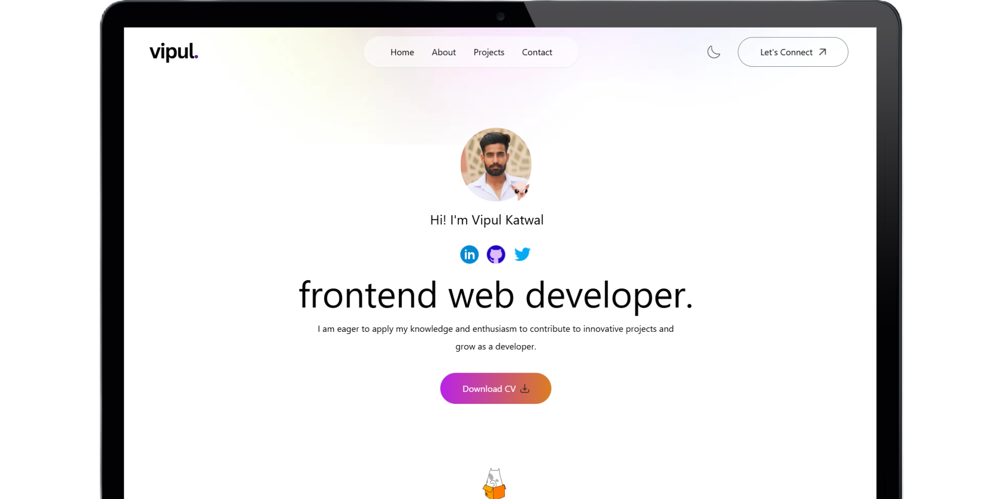

# 🚀 Frontend Developer Portfolio




## 🚀 About

Welcome to my personal portfolio! This project showcases my skills, projects, and experiences in a sleek and interactive way. With a built-in light and dark mode, visitors can enjoy browsing my work in their preferred visual style.

## ✨ Features

- 💼 Showcase of projects and skills
- 🌓 Toggle between light and dark mode
- 📱 Fully responsive design
- 🎨 Smooth animations and transitions
- 🔗 Easy-to-use navigation

## 🛠️ Built With

- [React.js](https://reactjs.org/) - A JavaScript library for building user interfaces
- [Tailwind CSS](https://tailwindcss.com/) - A utility-first CSS framework
- [Vite](https://vitejs.dev/) - Next generation frontend tooling

## 🏗️ Getting Started

### Prerequisites

- Node.js (version 14 or later)
- npm (usually comes with Node.js)

### Installation

1. Clone the repository
   ```
   git clone https://github.com/vipulkatwal/my-portfolio.git
   ```

2. Navigate to the project directory
   ```
   cd my-portfolio
   ```

3. Install dependencies
   ```
   npm install
   ```

4. Start the development server
   ```
   npm run dev
   ```

5. Open your browser and visit `http://localhost:5173`

## 🖥️ Usage

Navigate through the portfolio using the menu. Click on projects to view more details. Use the theme toggle to switch between light and dark mode.

## 📂 Project Structure

Here's a brief overview of the project structure:

```
portfolio/
├── public/
│ ├── assets/
│ │ ├── profile-img.jpg
│ │ ├── hand-icon.png
│ │ ├── linkedin-icon.png
│ │ ├── github-icon.png
│ │ └── twitter-icon.png
│ └── index.html
├── src/
│ ├── components/
│ │ ├── Header.js
│ │ └── Navbar.js
│ ├── assets/
│ │ ├── profile-img.jpg
│ │ ├── hand-icon.png
│ │ ├── linkedin-icon.png
│ │ ├── github-icon.png
│ │ └── twitter-icon.png
│ ├── App.js
│ ├── index.css
│ └── index.js
├── .gitignore
├── package.json
└── README.md
```

## 🤝 Contributing

Contributions, issues, and feature requests are welcome!


## 📜 License

Distributed under the MIT License. See `LICENSE` for more information.

## 📞 Contact

Shoot me mail  - [www.vipulkatwal17@gmail.com](www.vipulkatwal17@gmail.com)

Project Live Link: [Click Here](https://vipulkatwal-portfolio.vercel.app)

## 🙏 Acknowledgements

- [React Icons](https://react-icons.github.io/react-icons/)
- [Unsplash](https://unsplash.com) for the images
- [Vercel](https://vercel.com) for hosting

---

Don't forget to ⭐️ this repo if you like this portfolio!

⭐️ From [Vipul Katwal](https://github.com/vipulkatwal)
